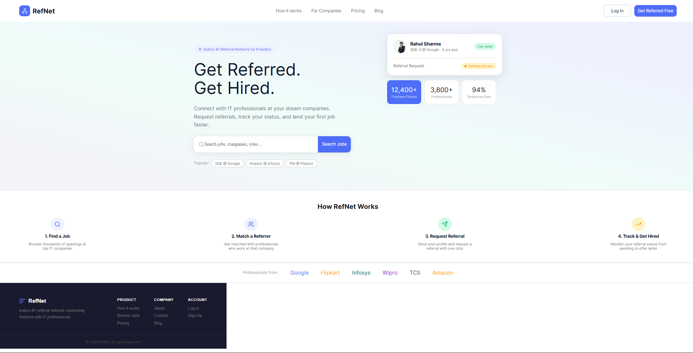
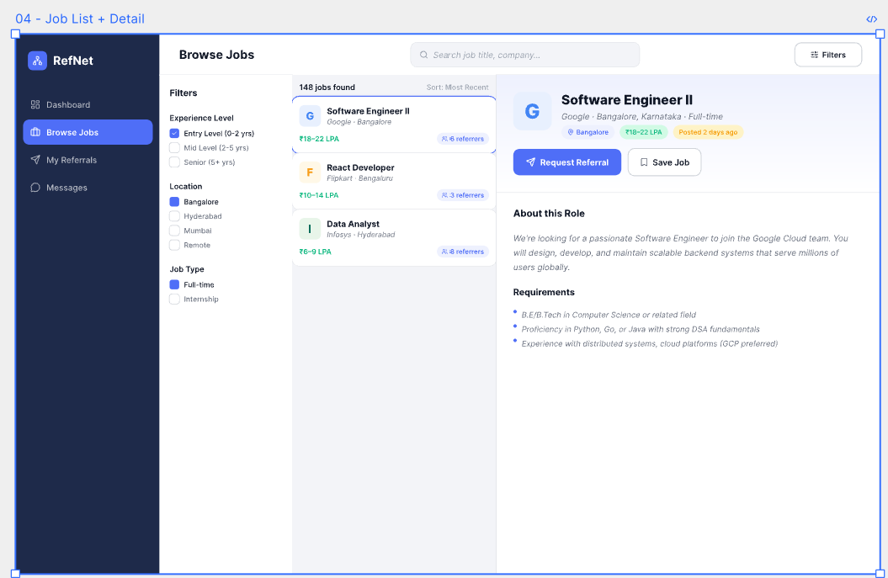
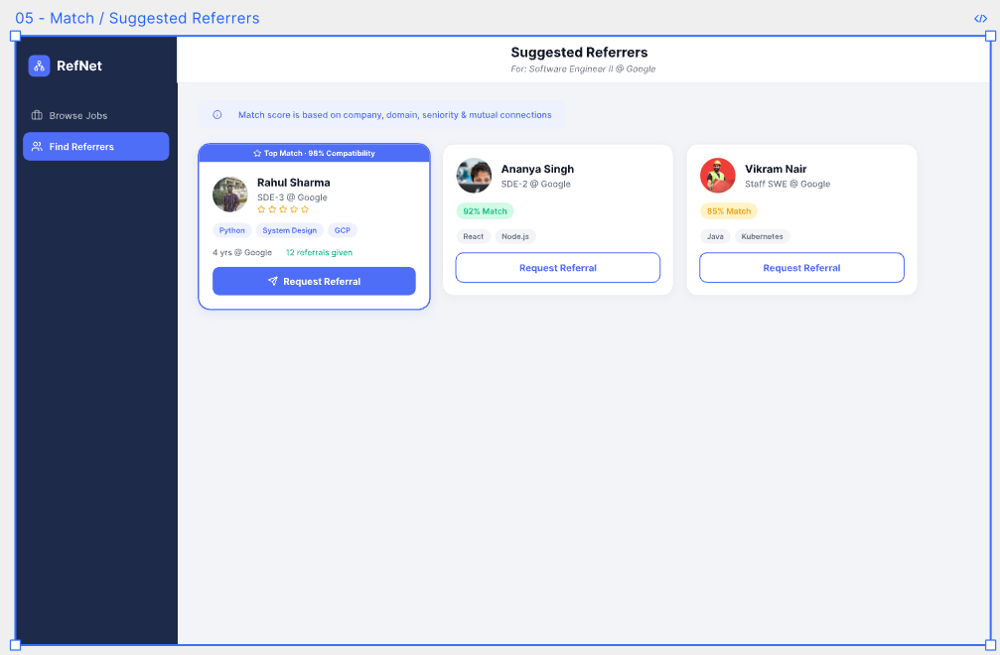
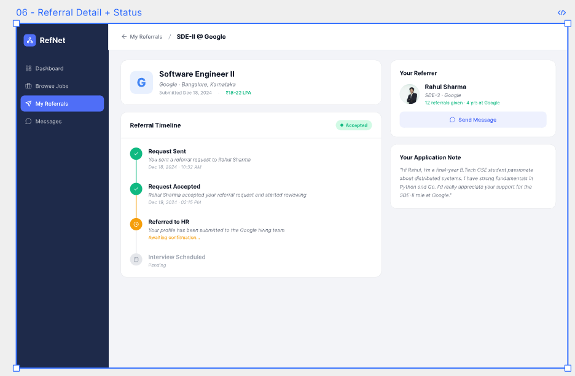
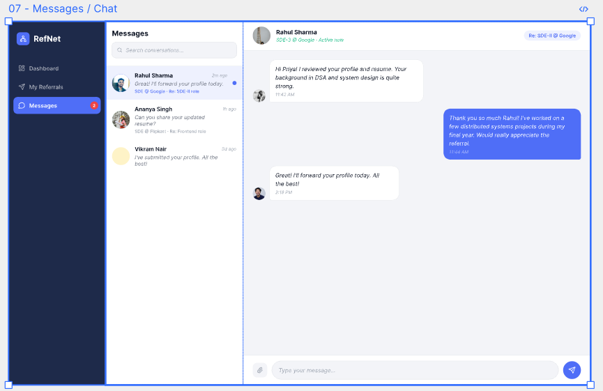
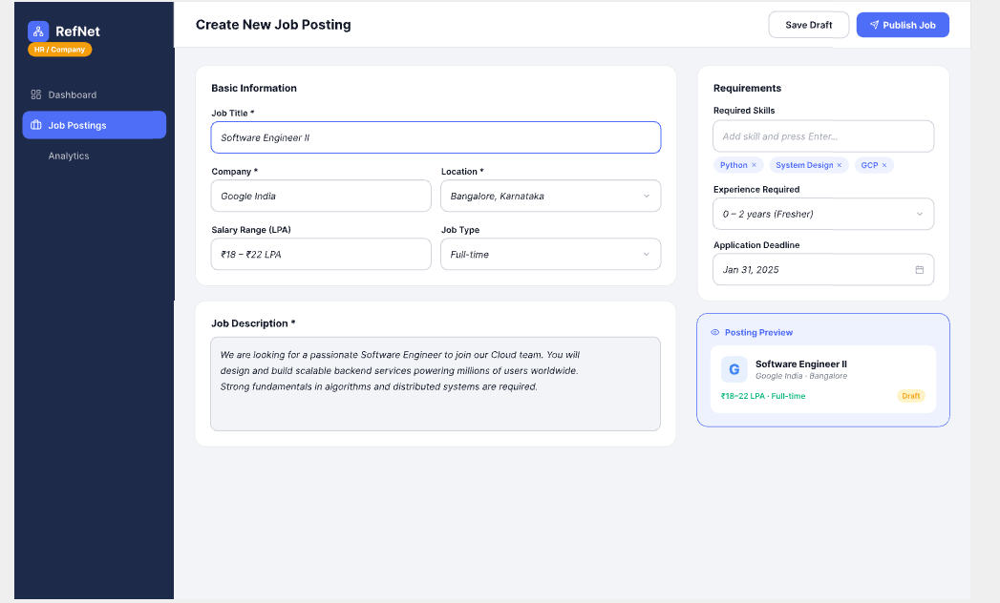
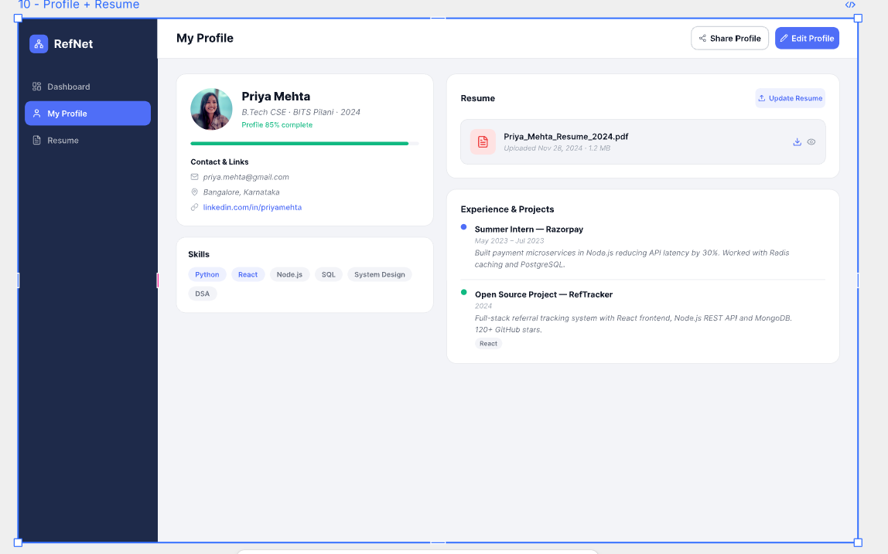
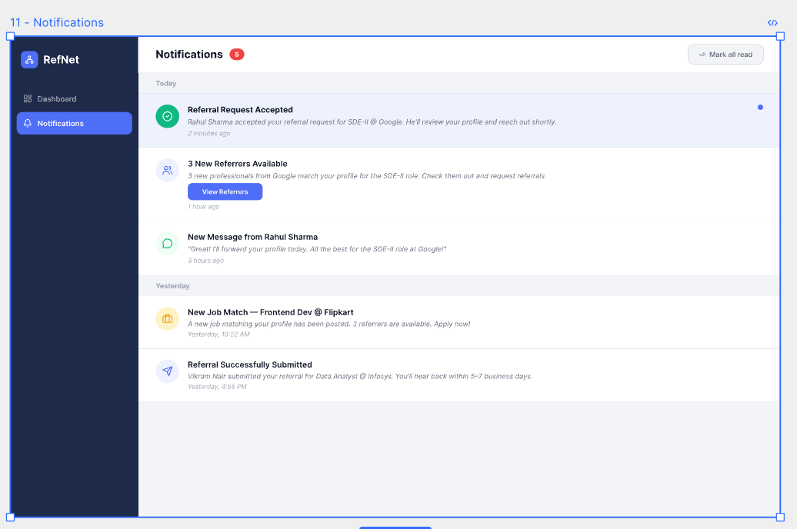
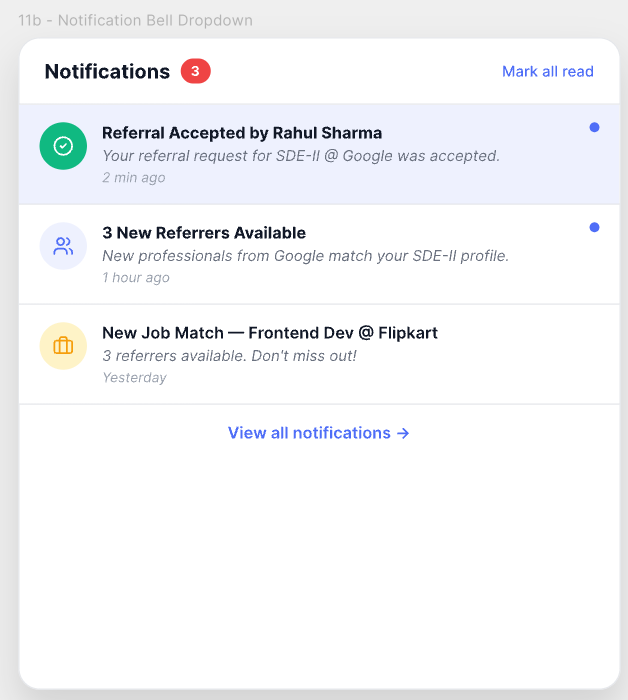

<p align="center">
  
</p>

<h1 align="center">RefNet — India's #1 Referral Network for Freshers</h1>

<p align="center">
  Connect with IT professionals at your dream companies.<br/>
  Request referrals, track your status, and land your first job faster.
</p>

<p align="center">
  
  
  
  
  
  
  
</p>

---

## 📸 Screenshots

### Landing Page

> Public home page with hero section, live search bar, "How RefNet Works" steps, company logos bar, and footer.

---

### Login / Register

> Two-column layout — brand pitch on the left, sign-in form on the right. Supports Fresher / Professional / HR / Company roles and Google OAuth.

---

### Fresher Dashboard

> Stat cards (Referrals Sent, Pending, Referred, Profile Views), Active Referrals list with status badges, and Recommended Jobs with "Get Referred" CTAs.

---

### Browse Jobs + Detail

> Three-panel layout: filter sidebar (Experience / Location / Job Type), job list with salary and referrer count, and inline job detail with Request Referral + Save Job buttons.

---

### Match / Suggested Referrers

> AI-matched referrer cards with compatibility score, skill chips, years at company, and referrals given. Top Match highlighted with a banner.

---

### Referral Detail + Status Timeline

> Breadcrumb navigation, referral timeline (Request Sent → Accepted → Referred to HR → Interview Scheduled), Your Referrer card, and Application Note.

---

### Messages / Chat

> Conversation list with search, active chat window with blue (sent) / white (received) bubbles, and message input with send button.

---

### Professional Inbox

> Professional role view — incoming referral requests with requester details, skill tags, and Accept / Decline / View Profile actions.

---

### Create Job Posting (HR)

> HR / Company dashboard for creating job postings with live preview card, required skills tags, experience level dropdown, and application deadline.

---

### My Profile + Resume

> Profile completeness bar, contact & links, skills chips, resume upload card with download/preview, and experience / projects timeline.

---

### Notifications Page

> Full notifications page grouped by Today / Yesterday with colored icons, unread blue dot, and action buttons like "View Referrers".

---

### Notification Bell Dropdown


> Compact dropdown from the bell icon — shows top notifications with Mark all read and View all link.

---

## ✨ Features

| Feature | Description |
|---------|-------------|
| 🔍 **Job Discovery** | Browse jobs with filters for experience level, location, and job type |
| 🤝 **AI Referrer Matching** | Get matched with professionals based on company, domain, seniority & connections |
| 📤 **One-Click Referral Request** | Send your profile to a referrer with a single click |
| 📊 **Referral Timeline** | Track status: Request Sent → Accepted → Referred to HR → Interview |
| 💬 **In-App Messaging** | Chat directly with referrers about your application |
| 🔔 **Notifications** | Real-time alerts for referral updates, new matches, and messages |
| 👤 **Profile & Resume** | Manage your profile, skills, projects, and resume upload |
| 🏢 **HR Dashboard** | Companies can post jobs and manage referral pipelines |
| 🔐 **Google OAuth** | Sign in with Google in addition to email/password |
| 🎨 **Pixel-perfect UI** | Matches the Pixso design system exactly |

---

## 🛠️ Tech Stack

| Layer | Technology |
|-------|-----------|
| Frontend Framework | React 19 + TypeScript 5.8 |
| Build Tool | Vite 7 |
| Routing | React Router 7 |
| State Management | Zustand 5 |
| HTTP Client | Axios |
| Styling | CSS3 (custom design system) |
| Animations | Motion |
| Backend | Node.js + Express + TypeScript |
| Database | PostgreSQL (via Sequelize) |
| Auth | JWT + Google OAuth (Passport.js) |
| File Storage | Cloudinary |

---

## 🚀 Quick Start

### Prerequisites
- Node.js v18+
- npm v9+
- Backend running → [Job_Referral_Network_System](https://github.com/MOHD-TAHA-KHAN/Job_Referral_Network_System)

### 1. Clone

```bash
git clone https://github.com/MOHD-TAHA-KHAN/Job_Referral_Network_System.git
```

### 2. Install frontend

```bash
cd "react-Design file/react"
npm install
```

### 3. Configure environment

```env
# react-Design file/react/.env
VITE_API_URL=http://localhost:3001/api
```

### 4. Run

```bash
npm run dev
# → http://localhost:5173
```

### 5. Build for production

```bash
npm run build
# output → dist/
```

---

## 📁 Project Structure

```
RefNet_UI/
├── screenshots/                    ← UI screenshots (this README)
├── react-Design file/react/
│   ├── src/
│   │   ├── components/
│   │   │   ├── AppSidebar.tsx      ← Shared dark navy sidebar
│   │   │   ├── NotificationBell.tsx← Bell icon + dropdown
│   │   │   └── ProtectedRoute.tsx  ← Auth guard
│   │   │
│   │   ├── pages/
│   │   │   ├── LandingPage.tsx     ← Public home
│   │   │   ├── LoginPage.tsx       ← Sign in (two-column)
│   │   │   ├── SignUpPage.tsx      ← Register (two-column)
│   │   │   ├── Dashboard.tsx       ← Fresher dashboard
│   │   │   ├── JobListings.tsx     ← Browse jobs (3-panel)
│   │   │   ├── JobDetails.tsx      ← Suggested referrers
│   │   │   ├── ReferralsPage.tsx   ← Timeline + Pro inbox
│   │   │   ├── Chat.tsx            ← Messages
│   │   │   ├── Profile.tsx         ← Profile + resume
│   │   │   ├── NotificationsPage.tsx
│   │   │   ├── SettingsPage.tsx    ← HR job posting
│   │   │   └── OnboardingPage.tsx  ← Post-signup wizard
│   │   │
│   │   ├── services/
│   │   │   ├── api.ts              ← Axios + interceptors
│   │   │   ├── authService.ts
│   │   │   ├── jobService.ts
│   │   │   ├── referralService.ts
│   │   │   └── profileService.ts
│   │   │
│   │   ├── store/
│   │   │   └── useAuthStore.ts     ← Zustand auth state
│   │   │
│   │   └── styles/
│   │       ├── design-system.css   ← Tokens, sidebar, cards, buttons
│   │       └── landing.css
│   │
│   ├── .env                        ← VITE_API_URL
│   └── package.json
```

---

## 🌐 Routes

| Path | Page | Auth Required |
|------|------|:---:|
| `/` | Landing Page | — |
| `/login` | Login | — |
| `/signup` | Sign Up | — |
| `/auth/callback` | Google OAuth Callback | — |
| `/dashboard` | Fresher Dashboard | ✅ |
| `/jobs` | Browse Jobs | ✅ |
| `/jobs/:id` | Suggested Referrers | ✅ |
| `/referrals` | My Referrals / Timeline | ✅ |
| `/chat` | Messages | ✅ |
| `/notifications` | Notifications | ✅ |
| `/profile` | Profile + Resume | ✅ |
| `/settings` | HR Job Posting | ✅ |
| `/onboarding` | Onboarding Wizard | ✅ |
| `/about` | How it Works | — |
| `/contact` | For Companies | — |

---

## 🔌 Backend API

Connects to [Job_Referral_Network_System](https://github.com/MOHD-TAHA-KHAN/Job_Referral_Network_System) backend (Node.js + PostgreSQL).

| Endpoint | Method | Used by |
|----------|--------|---------|
| `/auth/login` | POST | Login page |
| `/auth/register` | POST | Sign up page |
| `/auth/me` | GET | App startup |
| `/auth/google` | GET | Google OAuth |
| `/jobs` | GET | Browse Jobs |
| `/jobs/:id` | GET | Job Detail |
| `/jobs` | POST | HR Job Posting |
| `/referrals` | GET | Dashboard, Referrals |
| `/referrals` | POST | Request Referral |
| `/referrals/:id/status` | PATCH | Accept / Decline |
| `/matching/:jobId` | GET | Suggested Referrers |
| `/profile` | GET / PUT | Profile page |
| `/files/resume` | POST | Resume upload |

> **Dev preview mode:** Set `DEV_BYPASS_AUTH = true` in `ProtectedRoute.tsx` to browse all pages without logging in. Set to `false` before deploying.

---

## 🎨 Design System

All app pages share a consistent design defined in `src/styles/design-system.css`:

- **Sidebar** — Navy `#1e2a45`, active item accent `#4f6ef7`
- **Page background** — Light grey `#f0f2f8`
- **Cards** — White `#ffffff`, border `1px solid #e8eaf0`, radius `12px`
- **Status badges** — Pending (amber), Accepted (green), Rejected (red), Referred (blue)
- **Typography** — Inter, scale 11–26px
- **Buttons** — Primary (accent blue), Outline, Green (accept), Red outline (decline)

---

## 🤝 Contributing

```bash
git checkout -b feature/your-feature
git commit -m "feat: describe your change"
git push origin feature/your-feature
# open a Pull Request
```

---

## 📄 License

MIT © 2025 RefNet

---

<p align="center">Built for India's tech freshers 🇮🇳</p>
